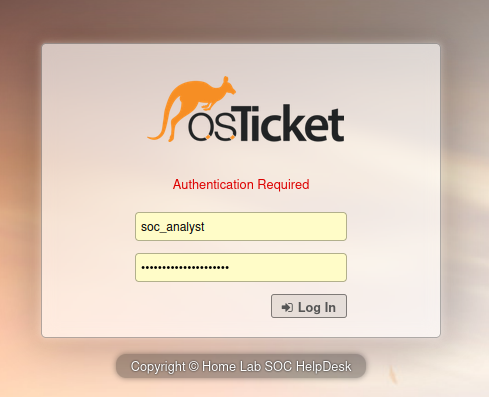
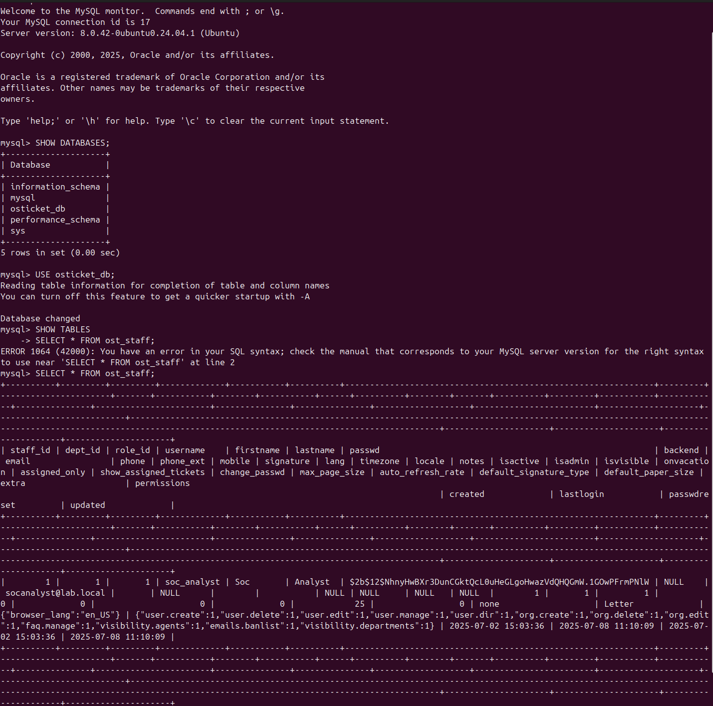
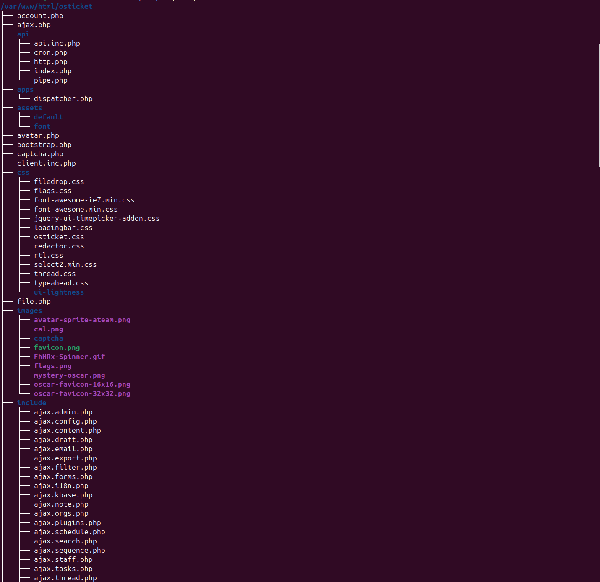
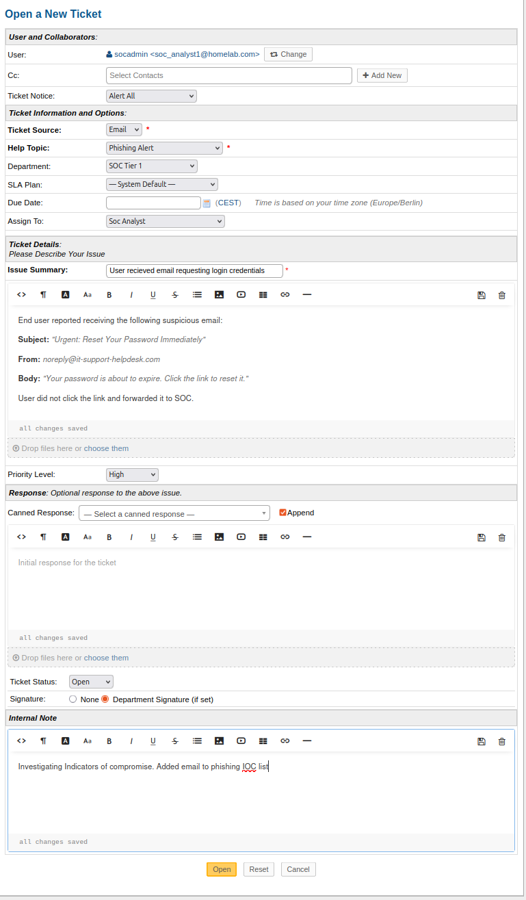
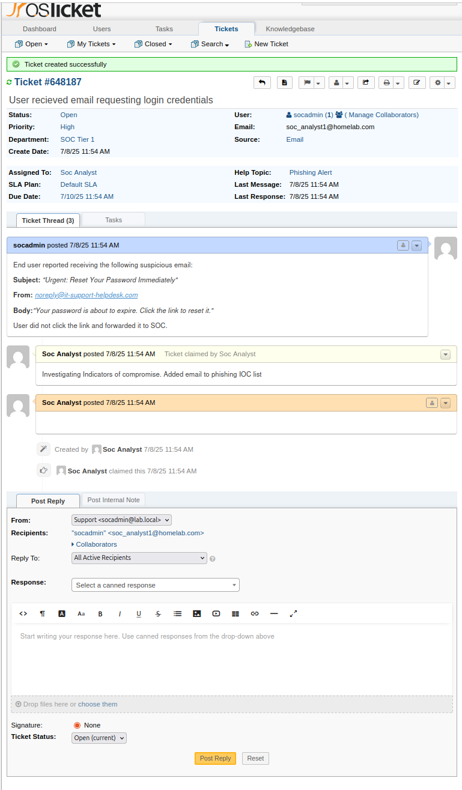
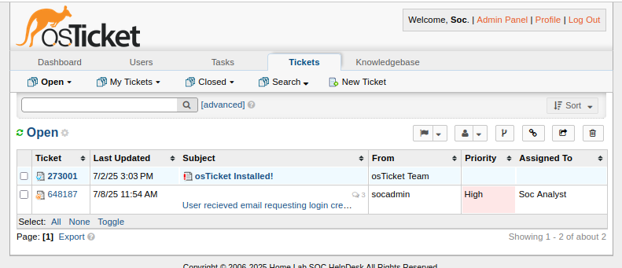

# osTicket Lab - SOC Helpdesk Simulation

This project documents the setup of a real-world style ticketing system using osTicket in a home lab environment. It simulates SOC workflows such as incident tracking, escalation, and resolution documentation.

## Project Objective

To deploy and configure a functional SOC helpdesk system that replicates enterprise workflows. This simulation supports alert triage, documentation, and analyst collaboration — all essential components of security operations.

## Repository Contents

- Step-by-step osTicket installation on Ubuntu
- MySQL configuration for the osTicket backend
- Apache HTTP/HTTPS setup for secure web access
- Password recovery using bcrypt and MySQL
- Project YAML file for GitHub Actions or metadata integration
- Clean configuration for easy deployment in other labs

## Build Summary

- **Host System**: ASUS ZenBook (VirtualBox running Ubuntu)
- **Virtual Machine OS**: Ubuntu 22.04 LTS
- **Hosting Stack**: LAMP (Linux, Apache, MySQL, PHP)
- **Ticketing Platform**: osTicket v1.18+
- **Access URL**: `https://localhost/osticket/scp/login.php`

## Technical Stack

| Component     | Technology         |
|---------------|--------------------|
| OS            | Ubuntu 22.04 LTS   |
| Web Server    | Apache2            |
| Database      | MySQL              |
| Language      | PHP 8.x            |
| Ticketing     | osTicket           |
| Encryption    | bcrypt via Python  |
| DevOps        | Git, GitHub        |

## Project Status

**Complete** — osTicket is fully installed and operational. Accessible via web browser. Password authentication verified. Version-controlled via GitHub.

## Screenshots

### osTicket Folder Structure  

### MySQL User Table View  

### Apache Web Root osTicket Installation  

### osTicket Interface - Create New Ticket  

### osTicket Interface - Submit Ticket  

### osTicket Ticket View with SOC Action  

